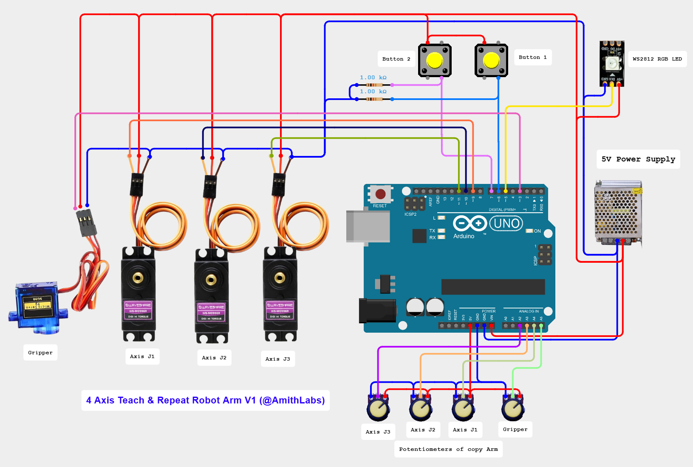

# Arduino 4 Axis Teach & Repeat Robot Arm

[](https://youtu.be/GHhGzDYB_6g)

📺 **Watch the Full Build Video on YouTube**  
https://youtu.be/GHhGzDYB_6g

---

## Project Overview

This project demonstrates a smart and interactive **Arduino 4 Axis Teach & Repeat Robot Arm** using an **Arduino UNO**, **L293D Motor Shield**, **Servo Motors**, **Potentiometer Controller**, and a **WS2812 RGB Status LED**.

The system allows manual robot teaching using potentiometers and stores robot positions in real-time.

The robot can replay saved positions automatically using smooth motion control.

At the same time, the WS2812 RGB LED acts as a live visual robot status indicator. As the robot operating mode changes, the RGB LED dynamically changes both:

* Robot operation state
* System status indication

The system uses four status modes:

* Red Zone → Teaching Mode
* Blue Zone → Position Saved
* Green Zone → Playback Running
* White Zone → Idle / Stop

This project is ideal for learning **Arduino programming, servo motor control, EEPROM memory storage, robotic motion teaching systems, and real-time robotic automation control**.

The full build process is available on the **AmithLabs YouTube channel**.

---

## Main Features

* Real-Time Robot Teaching
* EEPROM Position Memory
* Teach & Repeat Playback
* WS2812 RGB Status Indicator
* Smooth Servo Motion Control
* 20 Position Storage
* Continuous Motion Loop
* Beginner Friendly Arduino Project
* Professional Looking Smart Robot System

---

## Hardware Components

* Arduino UNO
* Arduino Uno Terminal Shield
* 3 MG996R Servo Motors
* 1 SG90 Servo Motor
* 4 10K Potentiometers
* WS2812 RGB LED
* 2 Push Buttons
* External 5V Power Supply
* Robot Arm Mechanical Structure

---

## Pin Configuration

| Component           | Arduino UNO Pin |
| ------------------- | ---------------- |
| Button 1            | D6               |
| Button 2            | D7               |
| WS2812 RGB LED      | D5               |
| Gripper Servo       | D3               |
| J1 Axis Servo       | D9               |
| J2 Axis Servo       | D10              |
| J3 Axis Servo       | D11              |
| Gripper Pot         | A5               |
| J1 Pot              | A4               |
| J2 Pot              | A3               |
| J3 Pot              | A2               |
| All GND Connections | GND              |

---

## Schematic Diagram



---

## System Operation

1. Arduino powers ON and initializes all devices.
2. Potentiometers read live controller positions.
3. Servo motors move according to controller input.
4. Button 1 activates teaching mode.
5. Robot movement is manually taught.
6. Current position is saved to EEPROM.
7. Multiple positions can be stored.
8. Button 2 starts automatic playback.
9. Robot continuously replays saved positions in real-time.

---

## Robot Status Zones

| Operation Mode | LED Color |
| -------------- | ---------- |
| Teaching Mode  | Red        |
| Position Saved | Blue       |
| Playback Mode  | Green      |
| Stop / Idle    | White      |

---

## Position Resolution

```text
20 Position Storage Capacity
